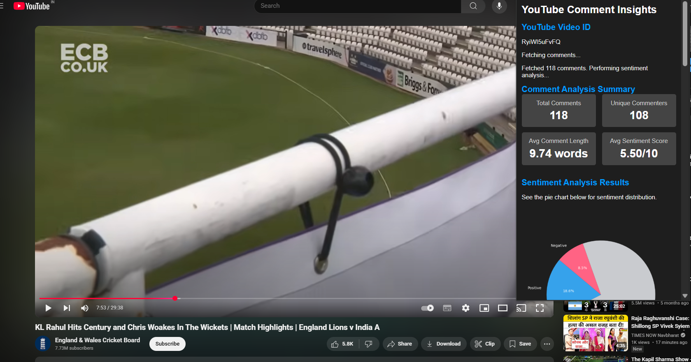
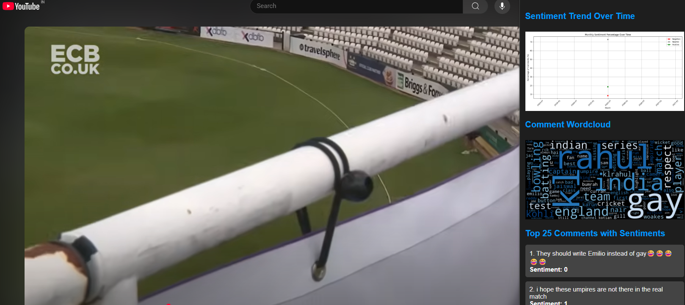

# 🎥 YouTube Sentiment Insights

## 🔍 Project Overview

**YouTube Sentiment Insights** is an end-to-end sentiment analysis system built for content creators (or anyone interested) to automatically analyze YouTube comments.

* Integrates a **Chrome Extension** and **Flask-based backend API**
* Classifies YouTube comments as:

  * ✅ Positive
  * ⚪ Neutral
  * ❌ Negative
* Helps creators understand viewer sentiment without manually reading all comments

---

## 🚀 Highlights

* 🔗 Easy-to-use Chrome Extension integrated into YouTube
* 📊 Interactive dashboard for sentiment trends and summaries
* 🔄 ML pipeline built using DVC for full version control
* 🐳 Dockerized and ready for CI/CD & AWS deployment
* 📈 ML models managed via MLFlow, with SMOTE, TF-IDF, and LightGBM for best performance

---

## 📊 Dashboard & Chrome Extension

built an intuitive **dashboard for creators**, featuring:

* 📌 Overall sentiment distribution (pie chart)
* 📈 Viewer sentiment trend over time
* 💬 Top comments and keyword cloud
* 🚀 Instant overlay on YouTube through the Chrome Extension
 Figure 1: Main dashboard view



*Figure 2: Top comments and sentiment trend*



## 🧠 Problem Statement

A **multi-class classification** problem to automatically label each YouTube comment as:

* Positive → `1`
* Neutral → `0`
* Negative → `-1`

**Goal**: Save time for creators and help them **adapt content based on real feedback.**

---

## 📂 Dataset Description

* 🧾 **Primary Dataset**: Reddit comments with labeled sentiments
* 👥 **It Simulates YouTube comment behavior**

**Structure**:

```csv
comment_text,sentiment
"Great explanation!",1
"I don't understand anything", -1
```

---

## 🔧 Pipeline & Methodology

### 📥 Data Collection

* Reddit comments dataset for training
* YouTube Data API for live comment fetch

### 🧹 Preprocessing & EDA

* Text cleaning: lowercasing, removing punctuation, stopwords
* N-gram feature extraction (bigrams, trigrams)
* Visuals: WordClouds, sentiment charts

### 🧪 Baseline Modeling

* CountVectorizer (10k features): \~64% accuracy
* TF-IDF with trigrams (max features = 1000)

### ⚖️ Handling Imbalance

* Used **SMOTE** to oversample under-represented classes (neutral/negative)

### 📊 Model Training

* Tried models: Naive Bayes, Logistic Regression, Decision Tree, XGBoost
* ✅ Best model: **LightGBM** (after tuning)

### 📦 Model Management

* Versioning using **DVC**
* Tracked experiments using **MLFlow**

### 🌐 Deployment

* Backend built using Flask
* Containerized via Docker
* CI/CD pipeline using GitHub Actions
* To be deployed on **AWS EC2**

### 🧩 Chrome Extension

* Embedded directly in YouTube’s video page
* Fetches visible comments
* Sends to backend for analysis
* Displays dashboard overlay on the video

---

## 📈 Insightful Visualizations

* ✅ **Comment Analysis Summary**
  → Total comments, unique users, average length, sentiment score

* 📊 **Sentiment Pie Chart**
  → Positive / Neutral / Negative %

* ⏱️ **Sentiment Over Time**
  → Trend line showing change across timeline

* ☁️ **Word Cloud**
  → Frequently used keywords

* 💬 **Top Comments with Sentiment**
  → Lists high-liked comments + predicted sentiment

---

## 🖥️ Installation & Setup

```bash
# 1. Clone the Repository
git clone https://github.com/your-repo/youtube-sentiment-insights.git
cd youtube-sentiment-insights

# 2. Create Virtual Environment
conda create -n youtube python=3.11 -y
conda activate youtube

# 3. Install Required Packages
pip install -r requirements.txt

# 4. Initialize DVC Pipeline
dvc init
dvc repro
dvc dag

# 5. (Optional) Configure AWS for Deployment
aws configure

# 6. Run the Flask API
python app.py
```

## 🧪 Running the API

### 📤 Sample Request

```http
POST /predict
Content-Type: application/json

{
  "comments": [
    "This video is awesome! I loved it a lot",
    "Very bad explanation. Poor video"
  ]
}
```

### 📥 Expected Response

```json
{
  "sentiments": ["1", "-1"]
}
```

---

## 🧩 Chrome Extension Setup

1. Visit: `chrome://extensions/`
2. Enable **Developer Mode**
3. Click **Load Unpacked**
4. Select the `extension/` folder from the project
5. Now visit a YouTube video → Click the extension → See sentiment insights!

